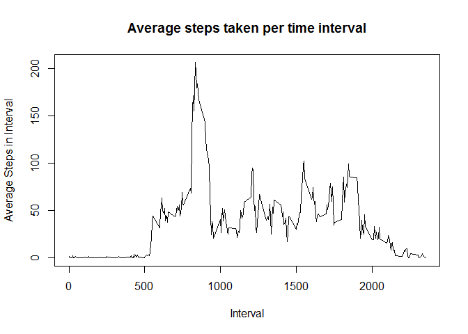

# Reproducible Research: Peer Assessment 1
Andrew Lockett  
Friday, May 15, 2015  

This R markdown file performs the tasks for Peer Assessment 1 of the 
Coursera Reproducible Research course. This includes loading the data set and 
then answering four questions relating to the data.

##Loading and preprocessing the data
Read in the activity data set. Set your working directory to this script's directory.
The activity.zip file should also be in this directory.


```r
activity <- read.csv(unzip("activity.zip"))
```

Convert the date field to proper date.

```r
activity$date <- strptime(activity$date, format="%Y-%m-%d", tz="UTC")
```

Show a summary of the data frame.
Note there are some missing measurements in the 'steps' column.

```r
summary(activity)
```

```
##      steps             date               interval     
##  Min.   :  0.00   Min.   :2012-10-01   Min.   :   0.0  
##  1st Qu.:  0.00   1st Qu.:2012-10-16   1st Qu.: 588.8  
##  Median :  0.00   Median :2012-10-31   Median :1177.5  
##  Mean   : 37.38   Mean   :2012-10-31   Mean   :1177.5  
##  3rd Qu.: 12.00   3rd Qu.:2012-11-15   3rd Qu.:1766.2  
##  Max.   :806.00   Max.   :2012-11-30   Max.   :2355.0  
##  NA's   :2304
```


##Q1: What is mean total number of steps taken per day?

First create a summary table showing the sum of steps for each day.
This ignores the missing 'steps' observations.

```r
library(plyr)
by_date <- ddply(activity, .(date), summarize, 
                 steps_sum=sum(steps, na.rm=TRUE),
                 bad_intervals=sum(is.na(steps)),
                 good_intervals=sum(!is.na(steps))
                 )
head(by_date)
```

```
##         date steps_sum bad_intervals good_intervals
## 1 2012-10-01         0           288              0
## 2 2012-10-02       126             0            288
## 3 2012-10-03     11352             0            288
## 4 2012-10-04     12116             0            288
## 5 2012-10-05     13294             0            288
## 6 2012-10-06     15420             0            288
```

Show the dates with missing observations.
Note several dates have no valid observations and hence zero steps_sum.

```r
subset(by_date, by_date$bad_intervals>0)
```

```
##          date steps_sum bad_intervals good_intervals
## 1  2012-10-01         0           288              0
## 8  2012-10-08         0           288              0
## 32 2012-11-01         0           288              0
## 35 2012-11-04         0           288              0
## 40 2012-11-09         0           288              0
## 41 2012-11-10         0           288              0
## 45 2012-11-14         0           288              0
## 61 2012-11-30         0           288              0
```

Histogram of total steps taken per date.
Note the dates with missing observations are first removed.

```r
good_dates <- subset(by_date, by_date$bad_intervals==0)

with(good_dates, {
        hist(steps_sum, col="grey", breaks=20,
             ylab="Number of Dates",
             xlab="Total Steps in day",
             main="Histogram of total steps taken per day")
        abline(v = median(steps_sum), col="blue", lwd=1)
        })
```

 

Show the mean & median total number of steps taken per day.

```r
mean_steps <- as.integer(round(mean(good_dates$steps_sum), digits=0))
median_steps <- as.integer(round(median(good_dates$steps_sum),digits=0))

mean_steps
```

```
## [1] 10766
```

```r
median_steps
```

```
## [1] 10765
```

The mean number of steps taken per day is 10766 and the median is 10765.


##Q2: What is the average daily activity pattern?

First create a summary table showing the average number of steps for each interval.
This ignores the missing 'steps' observations on those dates with no observations.


```r
library(plyr)
by_interval <- ddply(activity, .(interval), summarize, 
                 steps_sum=sum(steps, na.rm=TRUE),
                 steps_average=mean(steps, na.rm=TRUE),
                 bad_intervals=sum(is.na(steps)),
                 good_intervals=sum(!is.na(steps))
                 )

head(by_interval)
```

```
##   interval steps_sum steps_average bad_intervals good_intervals
## 1        0        91     1.7169811             8             53
## 2        5        18     0.3396226             8             53
## 3       10         7     0.1320755             8             53
## 4       15         8     0.1509434             8             53
## 5       20         4     0.0754717             8             53
## 6       25       111     2.0943396             8             53
```


```r
plot(by_interval$interval, by_interval$steps_average, type="l",
     ylab="Average Steps in Interval",
     xlab="Interval",
     main="Average steps taken per time interval")
```

 

Find the time interval with the highest average number of steps taken.

```r
by_interval$r <- rank(-by_interval$steps_average, na.last=TRUE) #reverse sign of average as rank finds smallest value

subset(by_interval,r==1)
```

```
##     interval steps_sum steps_average bad_intervals good_intervals r
## 104      835     10927      206.1698             8             53 1
```

```r
max_interval <- subset(by_interval, r==1, interval)
max_steps <- round(subset(by_interval, r==1, steps_average), digits=0)

max_interval
```

```
##     interval
## 104      835
```

```r
max_steps
```

```
##     steps_average
## 104           206
```

The interval with the highest number of steps is 835 (ie. 08:35 am) with an average number of steps across all days of 206.
  
##Q3: Imputing missing values
As seen above there are several dates with no valid observations for any of the intervals on that date. Therefore the mean number of steps for each interval (across all the valid dates) will be used to impute the missing values. Check number of rows with missing data.


```r
nrow(subset(activity, is.na(steps)))
```

```
## [1] 2304
```

Apply interval averages to missing steps records.

```r
library(plyr)
#calculate the average steps taken for each interval across all dates (exc. NA's)
interval_avg <- ddply(activity, .(interval), summarize,
                      steps_average=mean(steps, na.rm=TRUE)
                      )

#join this to the activity data set (as a new data frame activity2)
activity2 <- merge(activity, interval_avg, by.x="interval", by.y="interval", all=TRUE)

#update the missing values with the average number steps
activity2$steps <- ifelse(is.na(activity2$steps), activity2$steps_average, activity2$steps)

#re-sort table
activity2 <- activity2[order(activity2$date, activity2$interval),1:3]

head(activity2)
```

```
##     interval     steps       date
## 1          0 1.7169811 2012-10-01
## 63         5 0.3396226 2012-10-01
## 128       10 0.1320755 2012-10-01
## 205       15 0.1509434 2012-10-01
## 264       20 0.0754717 2012-10-01
## 327       25 2.0943396 2012-10-01
```

Alternative method:

```r
#sadly this alternative method does not work - crashes R
#library(plyr)
#impute.mean <- function(x) replace(x, is.na(x), mean(x, na.rm = TRUE))
#activity2 <- ddply(activity, ~ interval, transform, steps = impute.mean(steps))
#activity2 <- activity[order(activity$date, activity$interval), ]
#head(activity2)
```

Repeat code to create the histogram of total number of steps per day across the full data set with imputed values.

```r
library(plyr)
by_date2 <- ddply(activity2, .(date), summarize, 
                 steps_sum=sum(steps, na.rm=TRUE),
                 bad_intervals=sum(is.na(steps)),
                 good_intervals=sum(!is.na(steps))
                 )
```

Histogram of total steps taken per date.

```r
with(by_date2, {
        hist(steps_sum, col="grey", breaks=20,
             ylab="Number of Dates",
             xlab="Total Steps in day",
             main="Histogram of total steps taken per day")
        abline(v = median(steps_sum), col="blue", lwd=1)
        })
```

 

Show the mean & median total number of steps taken per day.

```r
mean_steps2 <- as.integer(round(mean(by_date2$steps_sum), digits=0))
median_steps2 <- as.integer(round(median(by_date2$steps_sum), digits=0))
```

The mean number of steps taken per day is 10766 and the median is 10766. Note this is almost exactly the same as the previous histogram which simply removed the missing observations. This is to be expected as we have imputed the missing observations as the mean for that interval so we have simply added more observations to the mean point of the distribution (hence the histogram has 8 more dates at the bar corresponding to the mean number of steps per day).


##Q4: Are there differences in activity patterns between weekdays and weekends?

First add fields showing day of week and weekday/weekend indicator.

```r
activity2$weekday <- weekdays(activity$date)

activity2$daytype <- ifelse(activity2$weekday=="Saturday" | activity2$weekday=="Sunday", "weekend", "weekday")

head(activity2)
```

```
##     interval     steps       date weekday daytype
## 1          0 1.7169811 2012-10-01  Monday weekday
## 63         5 0.3396226 2012-10-01  Monday weekday
## 128       10 0.1320755 2012-10-01  Monday weekday
## 205       15 0.1509434 2012-10-01  Monday weekday
## 264       20 0.0754717 2012-10-01  Monday weekday
## 327       25 2.0943396 2012-10-01  Monday weekday
```


```r
#summarise by daytype & interval
interval_avg2 <- ddply(activity2, .(interval, daytype), summarize,
                      steps_average=mean(steps, na.rm=TRUE)
                      )
#plot line chart
library(ggplot2)
```

```
## Warning: package 'ggplot2' was built under R version 3.1.3
```

```r
qplot(x=interval, 
      y=steps_average, 
      data=interval_avg2,
      facets = daytype ~ . ,
      geom="line", 
      main="Differences in activity patterns Weekdays vs Weekends",
      xlab="Interval",
      ylab="Average steps per interval")
```

 

The above plot shows that there are differences in activity patterns between weekdays and weekends.
On weekdays activity starts earliers in the day (just after 05:00am with a peak around 09:00am).
Activity is then relatively low during the dat and reduces sharply after 20:00. In contrast on weekends activity starts later in the day, with a lower peak and greater levels through the day and later into the evening.
